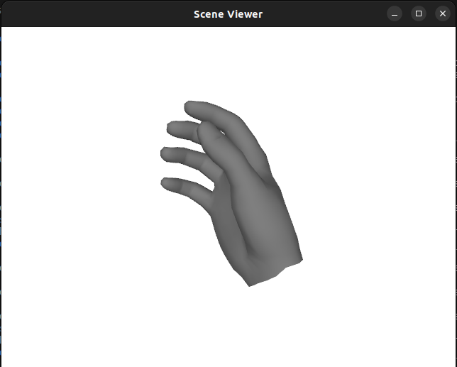

# HaMeR: Hand Mesh Recovery

## Code workflow

The whole workflow runs the following way:

- Runs human detection using ViTDet.
- Extracts hand keypoints using ViTPose.
- Computes bounding boxes for the hands.
- Runs the HaMeR model to generate 3D hand meshes.
- Renders the meshes and overlays them on the webcam feed or offline images.
- Displays the processed video stream in real-time or offline.

## Requirements
This has been tested on Ubuntu 22.4 machine with Nvidia 4070 RTX GPU and cuda 12.1. 

## Installation
Clone the repo:
```
git clone https://github.com/ArghyaChatterjee/hamer.git
cd hamer
```

We recommend creating a virtual environment for HaMeR. You can use venv:
```bash
python3.10 -m venv hamer_venv
source hamer_venv/bin/activate
pip3 install --upgrade pip setuptools wheel
```

Then, you can install the rest of the dependencies. This is for CUDA 12.1, but you can adapt accordingly:
```bash
pip3 install torch torchvision --index-url https://download.pytorch.org/whl/cu121
pip3 install -e .[all]
pip3 install -v -e third-party/ViTPose
```

If you want to install apex (needed for training, not needed for demo testing):
```bash
cd hamer
git clone https://github.com/NVIDIA/apex
cd apex
pip3 install -v --disable-pip-version-check --no-cache-dir --no-build-isolation --config-settings "--build-option=--cpp_ext" --config-settings "--build-option=--cuda_ext" ./
```

You also need to download the pre-trained models:
```bash
bash download_pretrained_checkpoints.sh
```

Once the checkpoints are downloaded for the pre-trained models and extracted, the folder structure looks like this:
```
hamer
  ├── _DATA
  │   ├── data
  │   ├── hamer_ckpts
  │   └── vitpose_ckpts
  ├── eval.py
  ├── docker
  ├── ...
  ...
```

Besides these files, you also need to download the MANO model. Please visit the [MANO website](https://mano.is.tue.mpg.de) and register to get access to the downloads section.  We only require the right hand model. You need to put `MANO_RIGHT.pkl` under the `_DATA/data/mano` folder.

You can download the model from the google drive as well. Here is the [link](https://drive.google.com/file/d/1dIqIesDh7n4TAFvp8uH7j-8uzyWOk2AB/view?usp=sharing).

The final folder structure should look like this:
```
hamer
  ├── _DATA
  │   ├── data
  |   |     ├── mano
  │   │     │     ├── MANO_RIGHT.pkl
  |   |     ├── mano_mean_params.npz
  │   ├── hamer_ckpts
  │   └── vitpose_ckpts
  ├── ...

```

## Offline Demo
If you want an offline demo, use this script:
```bash
python3 offline_demo.py --img_folder example_data --out_folder demo_out --batch_size=48 --side_view --save_mesh --full_frame --body_detector regnety
```
We are using `regnety` as the human body detector in stead of `vitdet`. If you want to use the `vitdet`, change the `--body_detector` to `vitdet`. If your code doesn't run, then change the batch size to `32`, `16`, `8`, `4`, `2` and `1`. 

## Online Demo

If you want an online demo, use this script:
```bash
python3 online_demo.py 
```
In this script, the input is your webcam image, the output is a box showing the detected and rendered hand mesh on that live image stream, `batch_size=48` and `body_detector` is set to `regnety`. Here is how the workflow starts:

1️⃣ Captures frames from the webcam using OpenCV.

2️⃣ Runs human detection using ViTDet.

3️⃣ Extracts hand keypoints using ViTPose.

4️⃣ Computes bounding boxes for the hands.

5️⃣ Runs the HaMeR model to generate 3D hand meshes.

6️⃣ Renders the meshes and overlays them on the webcam feed.

7️⃣ Displays the processed video stream in real-time.

8️⃣ Press 'Q' to exit.


## Visualize the Hand Mesh model

In order to visualize the hand model, run this script:
```bash
python3 visualize_hand_model_pickle.py
```

<p align="center">
  
</p>

If you want to convert the hand mesh model from `.pkl` to an `.obj` file, run the following script:
```bash
python3 export_hand_model_from_pkl_to_obj.py
```
The input for this script is `MANO_RIGHT.pkl`. Once you convert, you can openup the `MANO_RIGHT.obj` file in blender or meshlab. 

## HInt Dataset
Annotations for the HInt dataset has been released. Please follow the instructions [here](https://github.com/ddshan/hint).

## Training
First, download the training data to `./hamer_training_data/` by running:
```
bash download_training_data.sh
```

Then you can start training using the following command:
```bash
python3 train.py exp_name=hamer data=mix_all experiment=hamer_vit_transformer trainer=gpu launcher=local
```
Checkpoints and logs will be saved to `./logs/`.

## Evaluation
Download the [evaluation metadata](https://www.dropbox.com/scl/fi/7ip2vnnu355e2kqbyn1bc/hamer_evaluation_data.tar.gz?rlkey=nb4x10uc8mj2qlfq934t5mdlh) to `./hamer_evaluation_data/`. Additionally, download the FreiHAND, HO-3D, and HInt dataset images and update the corresponding paths in  `hamer/configs/datasets_eval.yaml`.

Run evaluation on multiple datasets as follows, results are stored in `results/eval_regression.csv`. 
```bash
python eval.py --dataset 'FREIHAND-VAL,HO3D-VAL,NEWDAYS-TEST-ALL,NEWDAYS-TEST-VIS,NEWDAYS-TEST-OCC,EPICK-TEST-ALL,EPICK-TEST-VIS,EPICK-TEST-OCC,EGO4D-TEST-ALL,EGO4D-TEST-VIS,EGO4D-TEST-OCC'
```

Results for HInt are stored in `results/eval_regression.csv`. For [FreiHAND](https://github.com/lmb-freiburg/freihand) and [HO-3D](https://codalab.lisn.upsaclay.fr/competitions/4318) you get as output a `.json` file that can be used for evaluation using their corresponding evaluation processes.

## Work with Custom Dataset
You will find the HInt dataset annotations [here](https://github.com/ddshan/hint).

## Install using Docker 

If you wish to use HaMeR with Docker, you can use the following command:

```
docker compose -f ./docker/docker-compose.yml up -d
```

After the image is built successfully, enter the container and run the steps as above:

```
docker compose -f ./docker/docker-compose.yml exec hamer-dev /bin/bash
```

Continue with the installation steps:

```bash
bash download_pretrained_checkpoints.sh
```

## Troubleshoot

Follow this github [issue](https://github.com/geopavlakos/hamer/issues/103) for troubleshooting the error. You need a decent VRAM (at least 12 GB) of the Nvidia RTX GPU or else it will continuously complain about cuda out of memory. My Nvidia 3060 RTX GPU with 6 GB VRAM could not run this code. To run this code, I had to switch to the Nvidia 4070 RTX GPU with 16 GB VRAM.

## Key Differences between SMPLH and MANO

1. SMPLH (SMPL + Hands): Skinned Multi-Person Linear model with Hands
2. MANO: Modeling and Capturing Hands Only 

- Scope
  - SMPLH: A full-body model that includes hand components, but with potentially lower hand detail if not merged with a more detailed hand model.
  - MANO: A dedicated hand model optimized for capturing detailed hand shapes and poses.

- Detail Level for Hands:

  - SMPLH: May use PCA-based hand representations for efficiency, which can reduce the number of parameters (and hence the detail) for the hands.
  - MANO: Provides a higher-dimensional and more detailed representation of the hand, capturing finer details in hand shape and finger articulation.

- Integration vs. Specialization:

  - SMPLH: Useful for integrated, whole-body tasks where you need a unified model that represents the entire human figure.
  - MANO: Specialized for tasks that require very accurate hand modeling, independent of the body.

## When to Use Which?
- Use SMPLH when your application requires a complete human model (e.g., full-body pose estimation, animation, or synthesis) and you need some hand modeling integrated into the overall model.

- Use MANO when your application focuses on the hand exclusively (e.g., detailed hand pose estimation, gesture recognition) or when you want to merge a high-detail hand model with a full-body model for enhanced hand fidelity.

